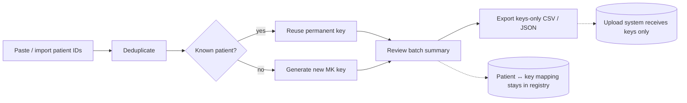

<p align="center">
  <h1 align="center">MolKey</h1>
  <p align="center"><em>Permanent patient pseudonym keys for molecular pathology</em></p>
</p>

<p align="center">
  
  
  
</p>

> [!IMPORTANT]
> MolKey is a **prototype** for hospital evaluation. It is not approved for real
> patient data until hospital IT, security, privacy, SMB concurrency, backup, and
> disaster-recovery requirements have been validated and signed off by governance.

## What MolKey does

MolKey generates and manages **permanent pseudonymous patient keys** (format
`MK-YYYY-XXXXXXXX`). Each internal patient ID receives exactly one random,
non-identifying key — forever. The mapping between patient IDs and keys lives only
inside a shared SQLite registry on the hospital's access-controlled secure drive.

| Capability | Detail |
|---|---|
| Permanent keys | One random key per patient, reused on every re-import |
| Batch generation | Paste one ID per line or import a CSV; duplicates are deduplicated, input order preserved |
| Keys-only export | CSV/JSON containing generated keys **only** — never patient IDs |
| Bidirectional lookup | Patient ID → key, or key → patient ID (internal use) |
| Shared registry | SQLite over SMB: rollback journal, `synchronous=FULL`, bounded retries, writer lock |
| Safe root validation | UNC paths and *active* mapped drives only; plain local paths rejected |
| Automatic bootstrap | Folders, database, and migrations are created at first start |

**Privacy model:** patient identifiers never leave the registry. External systems
(sequencing vendors, upload portals) receive generated keys only; MolKey is the
single place where the two are connected.

## Quick start

```bash
uv sync                       # create environment (or: pip install -e .[dev])
uv run molkey                 # start the desktop app
```

1. Open **Settings** and choose the approved secure shared folder
   (`\\server\share\...` or an active mapped drive such as `K:\`).
2. MolKey creates `registry.db` and its support folders automatically.
3. Generate single keys from the dashboard, paste a batch under
   **Batch generation**, review, then export keys-only CSV/JSON.

Optional environment override:

```bash
set MOLKEY_REGISTRY_ROOT=\\server\secure-share\MolKey   # per-workstation pinning
uv run molkey
```

## Workflow



## Architecture

Layered design with strict dependency direction:

```
src/molkey/
├── domain/           # identifiers, models, states, errors (pure)
├── application/      # PatientKeyService: get-or-create, batches, exports
├── infrastructure/   # SQLite database, migrations, repositories, writer lock
├── config.py         # secure-root validation (UNC + active mapped drive)
└── ui/               # PyQt6 main window, theme (#847CBA), fixed light palette
```

- **Schema:** v2 (`patient_keys` table); migrations run automatically and additively.
- **Concurrency:** short `BEGIN IMMEDIATE` transactions, `busy_timeout=5000`,
  `portalocker` writer lock in a `locks/` directory — multiple workstations can
  generate keys simultaneously.
- **Theming:** explicit dialog/messagebox/tooltip styles plus an application-wide
  fixed light palette so Windows dark mode can never produce unreadable popups.

## Development and testing

```bash
uv run pytest -q        # 107 tests (unit + integration + Qt UI)
uv run ruff check .     # lint
uv run mypy src         # strict type check
uv run python scripts/qualify_smb.py   # optional: SMB concurrency qualification
```

Follows TDD (RED → GREEN → REFACTOR). CI-relevant gates: full pytest suite, Ruff,
mypy strict, and GUI smoke via `scripts/capture_ui.py`.

## eMolPat portal integration

See [EMOLPAT_INTEGRATION.md](EMOLPAT_INTEGRATION.md) for the complete handoff:
manifest entry, pinned component spec, icon assets, offline requirements, and the
validation checklist for adding MolKey to the eMolPat portal suite.

## Safety and governance

- Prototype status: run against test registries until governance sign-off.
- The registry share must be access-controlled and backed up; MolKey assumes the
  hospital's standard protections for sensitive data folders.
- Audit trail of security-relevant events lives in the registry database.
