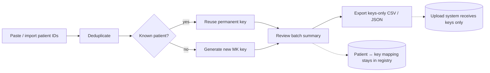

<p align="center">
  
  <h1 align="center">MolKey</h1>
  <p align="center"><em>Permanent patient pseudonym keys for molecular pathology</em></p>
</p>

<p align="center">
  
  
  
</p>

> [!IMPORTANT]
> MolKey is a **prototype** for hospital evaluation. It is not approved for real
> patient data until hospital IT, security, privacy, SMB concurrency, backup, and
> disaster-recovery requirements have been validated and signed off by governance.

## What MolKey does

MolKey generates and manages **permanent pseudonymous patient keys** (format
`MK` followed by seven random digits, for example `MK1234567`). Each internal patient ID
receives exactly one random, non-identifying key — forever. SQLite is the source
of truth; the protected Excel copy sits beside it on the hospital's secure drive.

| Capability | Detail |
|---|---|
| Permanent keys | One random key per patient, reused on every re-import |
| Batch generation | Paste one ID per line or import a CSV; duplicates are deduplicated, input order preserved |
| Keys-only export | CSV/JSON containing generated keys **only** — never patient IDs |
| Bidirectional lookup | Patient ID → key, or key → patient ID (internal use) |
| Excel register | Protected, searchable `MolKey-register.xlsx` beside `registry.db`, refreshed after new keys |
| Shared registry | SQLite over SMB: rollback journal, `synchronous=FULL`, bounded retries, writer lock |
| Safe root validation | UNC paths and *active* mapped drives only; plain local paths rejected |
| Automatic bootstrap | Folders, database, and migrations are created at first start |

**Privacy model:** patient identifiers remain on the protected registry share,
including its Excel copy. External systems (sequencing vendors, upload portals)
receive generated keys only. Never send `MolKey-register.xlsx` externally.

## Quick start

```bash
uv sync                       # create environment (or: pip install -e .[dev])
uv run molkey                 # start the desktop app
```

1. Open **Settings** and choose the approved secure shared folder
   (`\\server\share\...` or an active mapped drive such as `K:\`).
2. MolKey creates `registry.db` and its support folders automatically.
3. Generate single keys from the dashboard, paste a batch under
   **Batch generation**, review, then export keys-only CSV/JSON.

### Looking up a sample in Excel

Open `MolKey-register.xlsx` directly from the approved registry folder. The
`Register` sheet contains patient ID, MolKey, creation time, and creator initials;
use Excel's filter or Find to locate a sample. It is a **lookup copy**
of the database, not an input form; edits in Excel never change the database.
New keys written through MolKey refresh it
automatically; close and reopen the workbook to see changes made while it was
already open. If Excel has locked the file and an update cannot replace it,
MolKey retains the committed key and shows a warning. Close the workbook and use
**Refresh Excel** on the Key registry page. **Open Excel register** opens the copy
from the app. The workbook inherits the shared folder's access controls and
contains sensitive patient IDs, so keep it on the approved share and include it
in the share's backup and access review.

Optional environment override:

```bash
set MOLKEY_REGISTRY_ROOT=\\server\secure-share\MolKey   # per-workstation pinning
uv run molkey
```

## Workflow



## Architecture

Layered design with strict dependency direction:

```
src/molkey/
├── domain/           # identifiers, models, states, errors (pure)
├── application/      # PatientKeyService: get-or-create, batches, exports
├── infrastructure/   # SQLite database, migrations, repositories, writer lock
├── config.py         # secure-root validation (UNC + active mapped drive)
└── ui/               # PyQt6 main window, theme (#847CBA), fixed light palette
```

- **Schema:** v4; migrations run automatically and additively — existing
  shared databases upgrade in place, legacy keys are attributed as `UKJENT`
  (unknown). Patient IDs and DIT case numbers are stored in **upper case**
  and looked up case-insensitively (`26oum12345` = `26OUM12345`).
- **Identifiers:** new patient IDs contain only letters A–Z and digits 0–9;
  mixed case input is stored uppercase. New MolKeys also contain only letters
  and digits. Input with punctuation or spaces inside an ID is rejected rather
  than silently altered.
- **Shared registry view:** search scans **every** mapping in the shared database,
  including records beyond the first 500; the table shows the first 500 matches
  and displays the full match count. Search by patient ID, key, or creator initials.
- **Operator initials:** enter your initials (e.g. `CFB`) once on the Dashboard;
  they're remembered per workstation and stamped onto every key you create.
  Key generation is refused without them.
- **Concurrency:** short `BEGIN IMMEDIATE` transactions, `busy_timeout=30000`,
  `portalocker` writer lock in a `locks/` directory — multiple workstations can
  generate keys simultaneously; commits wait out active readers.
- **Theming:** explicit dialog/messagebox/tooltip styles plus an application-wide
  fixed light palette so Windows dark mode can never produce unreadable popups.
- **Icon:** the brand mark from the **Designer master**
  (`assets/molkey_icon_designer.png` — navy squircle tile: key + database +
  molecular network, rounded corners, transparent). Regenerate the PNG set
  and `molkey_icon.ico` with:

  ```bash
  uv run python scripts/render_icons.py
  ```

## Development and testing

```bash
uv run pytest -q        # unit + integration + Qt UI tests
uv run ruff check .     # lint
uv run mypy src         # strict type check
uv run python scripts/qualify_smb.py   # optional: SMB concurrency qualification
```

Follows TDD (RED → GREEN → REFACTOR). CI-relevant gates: full pytest suite, Ruff,
mypy strict, and GUI smoke via `scripts/capture_ui.py`.

## eMolPat portal integration

See [EMOLPAT_INTEGRATION.md](EMOLPAT_INTEGRATION.md) for the complete handoff:
manifest entry, pinned component spec, icon assets, offline requirements, and the
validation checklist for adding MolKey to the eMolPat portal suite.

## Safety and governance

- Prototype status: run against test registries until governance sign-off.
- The registry share must be access-controlled and backed up; MolKey assumes the
  hospital's standard protections for sensitive data folders.
- Audit trail of security-relevant events lives in the registry database.
