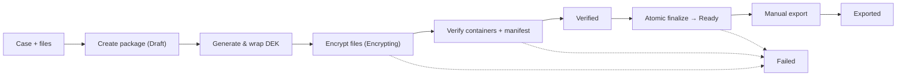

<p align="center">
  
</p>

<h1 align="center">MolVault</h1>

<p align="center">
  Secure Package Registry for molecular pathology — pseudonymous package IDs, AES-256-GCM encryption, SQLite on shared drive, PyQt6 desktop app.
</p>

<p align="center">
  
  
  
  
</p>

<p align="center">
  <a href="#quick-start">Quick start</a> ·
  <a href="#architecture">Architecture</a> ·
  <a href="#workflow">Workflow</a> ·
  <a href="#safety-and-governance">Safety</a> ·
  <a href="#development-and-testing">Development</a> ·
  <a href="docs/design/ui-ux-spec.md">UI/UX Spec</a>
</p>

> [!IMPORTANT]
> MolVault is a **prototype** for hospital evaluation. It is not approved for real patient data until hospital IT, security, privacy, key recovery, SMB concurrency, backup, and disaster-recovery requirements have been validated and signed off by governance.

## Overview

MolVault is a PyQt6 desktop application that creates **pseudonymous package IDs** (e.g., `SPK-2026-8F4C2A91`), encrypts data packages using **AES-256-GCM**, and maintains the protected relationship between packages and hospital case identifiers on an **access-controlled SMB share**.

| Area | Current implementation |
|---|---|
| Desktop interface | PyQt6 dashboard with sidebar navigation (Dashboard, Packages, Cases, Settings) |
| Registry | SQLite database on hospital SMB share with defensive locking and concurrency controls |
| Encryption | AES-256-GCM streaming; fresh 256-bit key per package; 96-bit random nonce per file |
| Key management | Certificate-wrapped DEKs; DPAPI-protected private key (MVP); production wrapper pending governance |
| Identifiers | Pseudonymous `SPK-YYYY-XXXXXXXX` packages; internal `CASE-` and `DIT` (`26OUM12287`) linkage |
| Export | Destination-agnostic; BaseSpace, external lab, research collaborator, internal archive as metadata only |
| Deployment | Source install or PyInstaller desktop bundle for Windows |

## Why MolVault

- **Privacy by design**: Patient identifiers never appear in package filenames, manifests, or exports
- **Cryptographic hygiene**: Authenticated encryption (GCM), per-package keys, per-file nonces, versioned container format
- **Shared-drive ready**: Rollback journaling, `synchronous=FULL`, bounded retries, application writer lock, startup reconciliation
- **Traceability**: Immutable audit events for every security-relevant action; lookup auditing configurable
- **Recoverable**: SQLite backup API, verified restore drills, key-wrapping interface designed for certificate/KMS escrow
- **Workstation friendly**: Runs on Microsoft Store Python 3.14 via `uv`; no local Rust toolchain required

## Workflow



### Identifier scheme

| Scope | Format | Example | Purpose |
|---|---|---|---|
| **DIT (patient/case)** | `YY<ORG><5-digit>` | `26OUM12287` | Internal hospital case number |
| **Case record** | `CASE-<8-hex>` | `CASE-A1B2C3D4` | Internal registry key |
| **Package** | `SPK-YYYY-<12-hex>` | `SPK-2026-8F4C2A91B3E7` | Public pseudonym for transfer |
| **Encryption key** | `KEY-<8-hex>` | `KEY-9A8B7C6D` | Wrapped DEK reference |

> **DIT breakdown**: `26` = year 2026, `OUM` = organizational unit, `12287` = sequential case number. MolVault stores the DIT internally; it never leaves the registry.

## Architecture

```text
PyQt6 UI
  → Application services (case, package, encryption, search, backup, reconciliation)
  → Domain models (states, identifiers, records, transitions)
  → Infrastructure (SQLite, writer lock, encrypted file format, key wrapping, filesystem, audit)
  → Destination adapters (metadata only in MVP)
```

### Layer boundaries

- **UI** — Pure PyQt6; no business logic; worker threads for I/O/crypto
- **Application** — Orchestrates workflows; single public method per use case
- **Domain** — Frozen dataclasses, enums, validation; zero external dependencies
- **Infrastructure** — SQLite, crypto, locking, files; swappable via protocols

## Safety and governance

MolVault treats quality and completeness as part of the registry contract:

- **Package states** carry explicit transitions: `Draft → Encrypting → Verified → Finalizing → Ready → Exported` (and `Failed` from any active state)
- **Ambiguous operations** become `Failed` with actionable audit data instead of silent data loss
- **Strict modes** available for validation: read-only registry, simulated network disconnect, crash-recovery drills
- **Manual adjustments** (key rotation, re-encryption) are versioned and provenance-tracked
- **Export manifests** contain only package ID, format versions, export names, sizes, encrypted SHA-256 — **no patient data, keys, or internal IDs**
- **Database writes** use guarded transactions (`BEGIN IMMEDIATE`) and application-level writer lock on `{root}/locks/registry.writer.lock`

The architecture, threat model, and engineering validation boundaries are documented in the [UI/UX design specification](docs/design/ui-ux-spec.md) and the [TDD implementation plan](.hermes/plans/2026-08-20_secure-package-registry-tdd-plan.md).

## Quick start

### Windows with Python 3.14 (Microsoft Store / Ivanti managed)

The `uv`-managed environment is the preferred route on a work computer without admin rights.

```powershell
git clone https://github.com/Christian-Bjornstad/MolVault.git
cd MolVault

# uv is available via Microsoft Store Python or pipx
uv sync --dev

# Configure registry root (UNC path to hospital secure share)
$env:MOLVAULT_REGISTRY_ROOT = "\\hospital-secure-drive\molecular-pathology\secure-package-registry"

# Run the application
uv run molvault
```

Verify the environment:

```powershell
uv run pytest -q
uv run ruff check .
uv run mypy src
```

### Registry initialization

On first run with a valid `MOLVAULT_REGISTRY_ROOT`, MolVault will:

1. Validate the UNC path is reachable and writable
2. Create subdirectories: `packages/`, `staging/`, `certs/`, `locks/`
3. Run schema migrations (idempotent)
4. Start the dashboard

> **Production requirement**: `MOLVAULT_REGISTRY_ROOT` must be a UNC path (`\\server\share\...`). Local paths are only permitted when `MOLVAULT_TEST_MODE=1` is set.

## Application navigation

| Page | Purpose |
|---|---|
| **Dashboard** | Registry health, package/case counts by state, stale-work warnings, last backup |
| **Packages** | Search, filter, inspect package details, trigger export tracking |
| **Cases** | Create/view case records, link DIT numbers, initiate package creation |
| **Settings** | Registry path, destination presets, key-wrapper configuration (production) |

## Development and testing

Run the complete Python suite:

```bash
uv run pytest -q
```

Run with coverage:

```bash
uv run pytest --cov=molvault --cov-report=term-missing
```

Run security-focused tests:

```bash
uv run pytest tests/security -q
```

Run SMB concurrency qualification (requires real hospital share):

```bash
$env:MOLVAULT_TEST_REGISTRY_ROOT = "\\hospital-secure-drive\molecular-pathology\secure-package-registry"
uv run pytest tests/smb -q -m smb
```

Static checks:

```bash
uv run ruff check .
uv run ruff format --check .
uv run mypy src
```

## Repository structure

```text
MolVault/
├── .hermes/plans/           # Implementation plans
├── assets/                  # Application icon, bundled assets
├── docs/
│   └── design/              # UI/UX spec, encrypted-file-format.md, key-recovery.md
├── packaging/               # PyInstaller spec, build scripts
├── scripts/
│   ├── initialize_registry.py
│   ├── check_registry.py
│   ├── backup_registry.py
│   └── restore_registry.py
├── src/molvault/
│   ├── __init__.py
│   ├── __main__.py
│   ├── config.py
│   ├── domain/
│   │   ├── errors.py
│   │   ├── identifiers.py
│   │   ├── models.py
│   │   └── states.py
│   ├── application/
│   └── ui/
│       ├── theme.py
│       ├── main_window.py
│       └── ...
├── tests/
│   ├── unit/
│   ├── integration/
│   ├── ui/
│   ├── security/
│   └── smb/
└── pyproject.toml
```

## Data and generated files

The following stay outside version control:

- SQLite registry database and WAL/shm files on the SMB share
- Encrypted package directories under `{root}/packages/`
- Staging directories under `{root}/staging/`
- Certificate/key material under `{root}/certs/`
- Backup files (timestamped `.bak`)
- Python caches, `build/`, `dist/`, `uv.lock`
- Local runtime artifacts, `artifacts/`

## Further documentation

- [UI/UX Design Specification](docs/design/ui-ux-spec.md)
- [TDD Implementation Plan](.hermes/plans/2026-08-20_secure-package-registry-tdd-plan.md)
- [Encrypted File Format v1](docs/encrypted-file-format.md) (planned)
- [Key Recovery Procedure](docs/key-recovery.md) (planned)
- [Disaster Recovery Drill](docs/disaster-recovery.md) (planned)
- [SMB Pilot Protocol](docs/smb-pilot.md) (planned)

## Third-party notices

This project uses the following major dependencies:

- **PyQt6** — GPL v3 / commercial license (see `LICENSES/PyQt6_GPL.txt`)
- **cryptography** — Apache-2.0 / BSD
- **portalocker** — MIT
- **platformdirs** — MIT

Licenses are retained in `LICENSES/` where applicable.